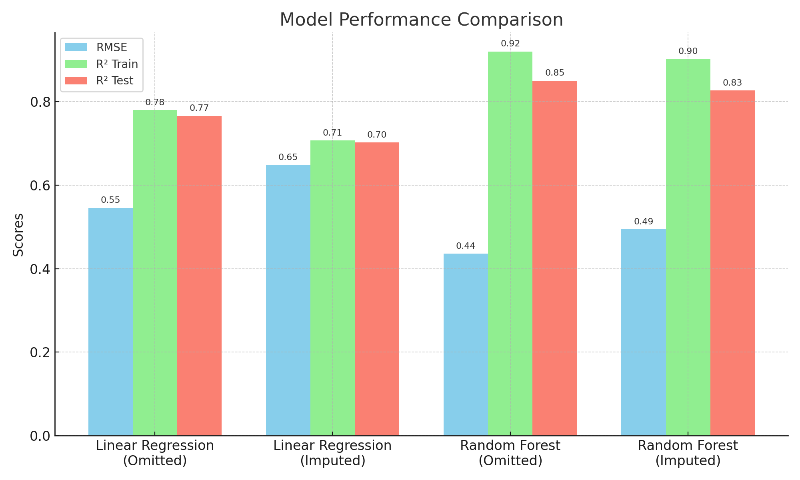

# Price Prediction of Pre-owned Cars

## Table of Contents

- [Problem Statement](#problem-statement)
- [Dataset](#dataset)
- [Technologies Used](#technologies-used)
- [Steps Performed](#steps-performed)
- [Data Cleaning](#data-cleaning)
- [Significant & Insignificant variabels](#significant-&-insignificant-variabels)
- [Results](#results)
- [Acknowledgements](#acknowledgements)

---

## Problem Statement

Storm Motors is an e-commerce company who act as mediators between parties interested in selling and buying pre-owned cars. For the year 2015-2016, they have recorded data about the seller and car including: - Specification details, Condition of car, Seller details, Registration details, Web advertisement details, Make and model information and Price. The company wishes to develop an algorithm to predict the price of the cars based on various attributes associated with the car.

## Dataset

Here is the [dataset](cars_sampled.csv) description of:
| Variables | Datatype | Description |
|----------|----------|-------------|
| _dateCrawled_ | date | date when the ad first crawled |
| _name_ | string | string consisting of car name, brand, model etc. |
| _seller_ | string | nature of seller |
| _offerType_ | string | whether the car is on offer or the buyer requested an offer |
| _price_ | integer | price on the ad to sell the car |
| _abtest_ | string | two versions of ad |
| _vehicleType_ | string | types of cars |
| _yearOfRegistration_ | integer | year in which car was registered |
| _gearbox_ | string | type of gearbox |
| _powerPS_ | integer | HP |
| _model_ | string | model type |
| _kilometers_ | integer | kilometers car has travelled |
| _monthOfRegistration_ | integer | month of registration |
| _fuelType_ | string | types of fuel |
| _brand_ | string | make of a car |
| _notRepairedDamage_ | string | status of repair for damages (yes, if damage not rectified) |
| _dateCreated_ | date | date on which the ad was created |
| _postalCode_ | integer | postal code of seller |
| _lastSeen_ | date | when the crawler saw the ad last online |

Grouping variables:

| Details | Variables |
|---------|-----------|
| Specification details | _gearbox, powerPS, fuelType_ |
| Condition of car | _notRepairedDamage, Kilometer_ |
| Seller details | _seller, postalCode_ |
| Registration details | _yearOfRegistration, monthOfRegistration_ |
| Make and model | _brand, model, vehicleType_ |
| Advertisement details | _dateCrawled, name, abtest, dateCreated, lastSeen, offerType_ |

## Technologies Used

- Python
- Pandas
- Matplotlib, Seaborn
- Scikit-Learn
- Jupyter Notebook

## Steps Performed

- Libraries imported.
- Load dataset.
- Removed unwanted columns (_dateCrawled, name, postalCode, dateCreated, lastSeen_).
- Removed duplicates.
- Data Cleaning - removing extreme values from (_yearOfRegistration, price, powerPS_) and creating the '_age_' column.
- Finding insignificant vaiables with the help of visualisations.
- Dropping insignificant variables and null values.
- Model building (omitted data) - base model, linear regression model, random forest model.
- Model building (imputed data) - base model, linear regression model, random forest model.
- Compared models' accuracy with both omitted & imputed data.

## Data Cleaning

- _Extreme Values:_ The variable _yearOfRegistration_ contains extreme and unrealistic values such as 1000, 1255, 8500, and 9999. Since these are not feasible, it was necessary to define a valid range for this variable. Other variables like _price_ and _powerPS_ also contain outliers, so appropriate working ranges were established for them as well.
- _Age:_ A new column named _age_ was created to represent the age of the car by combining _yearOfRegistration_ and _monthOfRegistration_. This was calculated using the formula: **data['age'] = (2018-data['yearOfRegistration'])+(data['monthOfRegistration']/12)**
- The columns _yearOfRegistration_ and _monthOfRegistration_, along with rows containing null values, were dropped in a copy of the dataset (used for building models on data with omitted values). For the imputed version, missing values were filled using the median before building the models.

## Significant & Insignificant variabels

Several [visualizations](others/Price_prediction_of_preowned_cars_visualisation) were created to analyze the relationship between each variable and the _price_. This helped identify which variables are significant and should be included in the modeling process.

| Category | Variables |
|----------|-----------|
| Insignificant Variables | _abtest, seller, offerType_ |
| Significant Variabels | _price, vehicleType, gearbox, powerPS, model, kilometer, fuelType, brand, notRepairedDamage, age_ |

_Note:-_ Our Models were created in two cases:
1. With dropping of null values and insignificant variables.
2. With filling null values with the median and using both significant and insignificant variables.

## Result

Here is the metrics of the models and summary of the project:
| Model | RMSE | RSquared (train, test) |
|-------|------|------------------------|
| Linear Regression (Omitted Values) | 54.55 % | 78.00 %, 76.58 % |
| Random Forest (Omitted Values) | 43.60 % | 92.02 %, 85.04 % |
| Linear Regression (Imputed Values) | 64.83 % | 70.71 %, 70.73 % |
| Random Forest (Imputed Values) | 49.43 % | 90.24 %, 82.69 % |

It is observed that Random Forest model (with omitted data) performs better than Linear Regression model. This is because of:
- Lowest RMSE (0.4361): RMSE (Root Mean Square Error) measures the average magnitude of the prediction error. A lower RMSE means the model's predictions are closer to actual values.
- Highest R² Scores: R² (R-squared) shows how well the model explains the variability in the target variable. It has the highest R² on both train (0.9202) and test (0.8504) sets, indicating strong model fit and generalization.
- Better Generalization: The relatively small gap between train and test R² suggests it is not overfitting.
